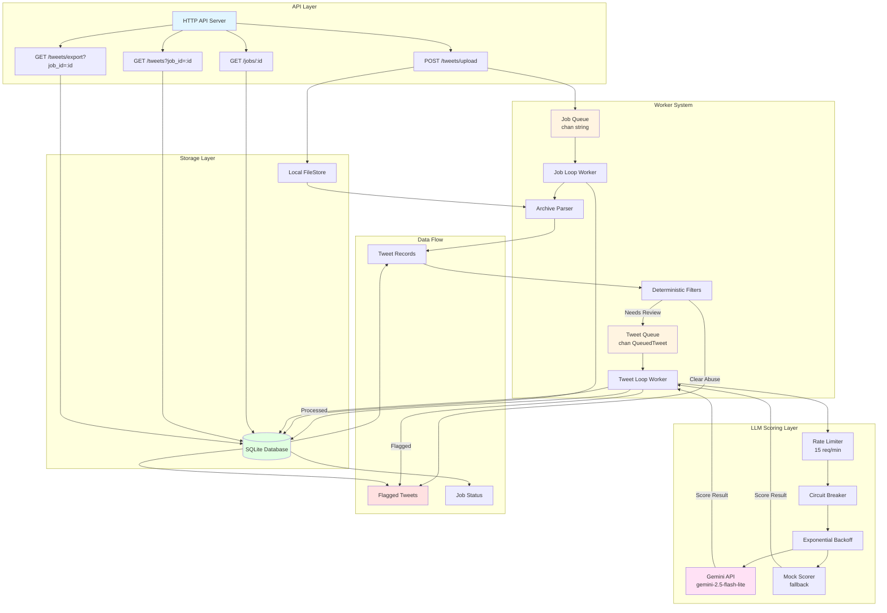
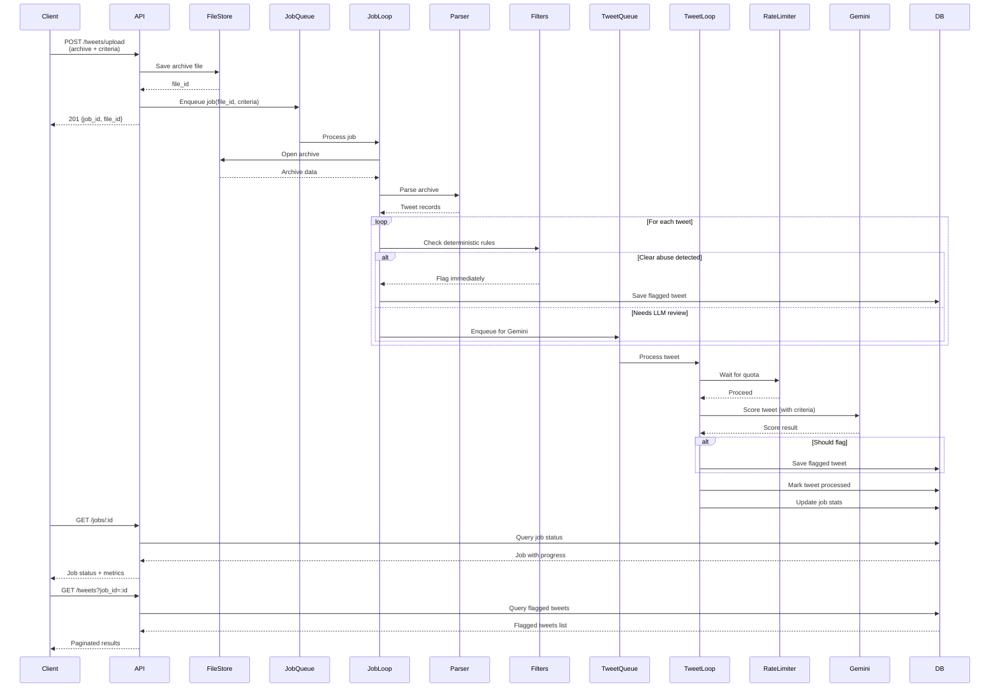
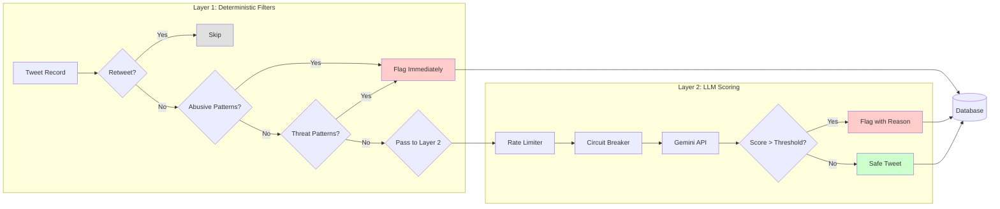
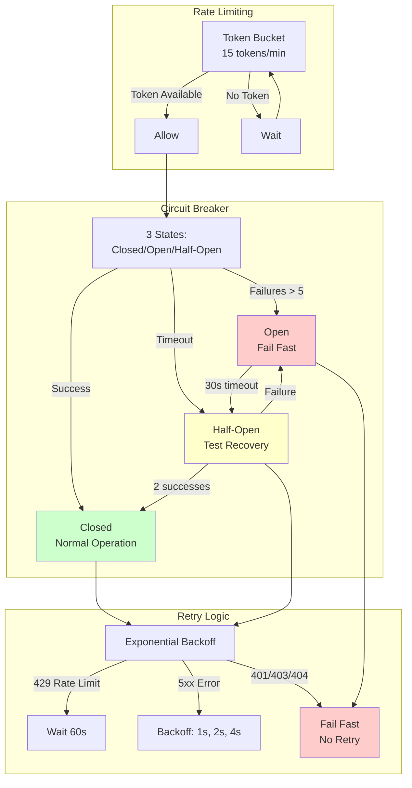

# tweet-audit

This tool processes your X archive, evaluates each tweet against your alignment criteria (e.g., unprofessional language, specific keywords, outdated opinions), and generates a list of tweet URLs marked for manual deletion. This can be helpful to purging your X account with tweets that aren't social worthy or doesn't tell about your persona anymore.

## Architecture



## Processing Flow



## Two-Layer Detection System



## Resilience Patterns



## Setup

### 1. Install Dependencies

```bash
go mod download
```

### 2. Setup Gemini API (Optional)

1. Get a Gemini API key from [Google AI Studio](https://makersuite.google.com/app/apikey)
2. Create a `.env` file:
   ```bash
   cp .env.example .env
   ```
3. Add your API key:
   ```
   GEMINI_API_KEY=your_actual_api_key_here
   ```

### 3. Run the Server

```bash
go run cmd/tweet-audit/main.go
```

The server will use Gemini if `GEMINI_API_KEY` is set, otherwise it falls back to the mock scorer.

## API Endpoints

- `POST /tweets/upload` - Upload archive (ZIP or JS file) with optional moderation criteria
- `GET /jobs/{id}` - Check job processing status and progress
- `GET /tweets?job_id={id}` - List flagged tweets with pagination
- `GET /tweets/export?job_id={id}&format=json|csv` - Export flagged tweet URLs
- `GET /swagger/` - Interactive API documentation

## Testing

Run all tests:

```bash
go test ./internal/tweets/...
```

Tests use `MockScorer` - no Gemini API calls, no costs, no network dependency. SQLite tests use temporary databases that are cleaned up automatically.

## Key Design Decisions

- **Async Processing**: Upload returns immediately with a job_id. Heavy work (parsing + LLM) happens in background workers
- **Two-Layer Detection**: Fast deterministic filters catch obvious cases, LLM handles nuanced ones
- **Rate Limiting**: Built-in 15 req/min limit for Gemini free tier compliance
- **Circuit Breaker**: Prevents cascading failures when API is down
- **SQLite**: Zero-config database perfect for single-user/small-team use
- **Local Storage**: Simple file-based storage, can swap to S3 later via FileStore interface

See [TRADEOFFS.md](./TRADEOFFS.md) for detailed architectural decisions and tradeoffs.
